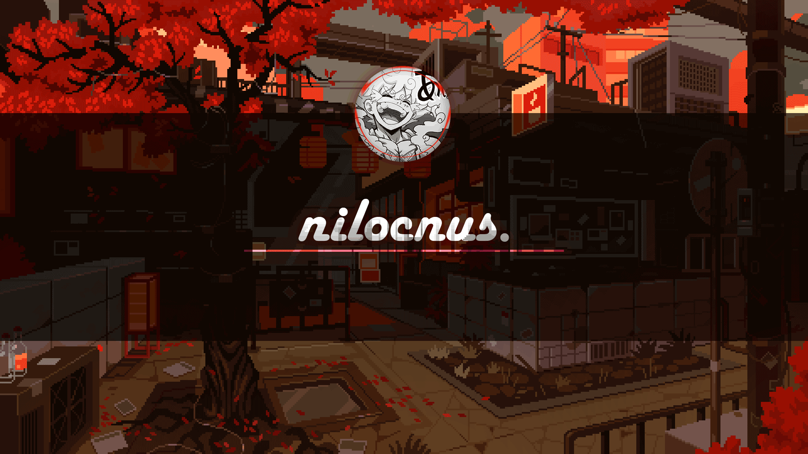

# 🎉 Welcome to my page!

**`Kitchen Sink (GFX/Developer/Writer)`**  

---

 <em>
❝ To see a World in a Grain of Sand  
And a Heaven in a Wild Flower  
Hold Infinity in the palm of your hand  
And Eternity in an hour ❞ </em>  
<b>— William Blake in Auguries of Innocence</b>

---

Hey there 👋 Thanks for stumbling upon my humble abode! I'm currently a CS student, project contributor, and food enthusiast. I enjoy spending my time writing, reading old and new media alike, learning new and fun stuff, creating graphics, developing, gaming, traveling, cooking, you get the gist. Enjoy the stay. Oh, and check out my website if you want to know more.

<picture>
  <source
    srcset="https://github-readme-stats.vercel.app/api?username=nilocnus&show_icons=true&theme=date_night"
    media="(prefers-color-scheme: dark)"
  />
  <source
    srcset="https://github-readme-stats.vercel.app/api?username=nilocnus&show_icons=true&theme=rose"
    media="(prefers-color-scheme: light), (prefers-color-scheme: no-preference)"
  />
  
</picture>
